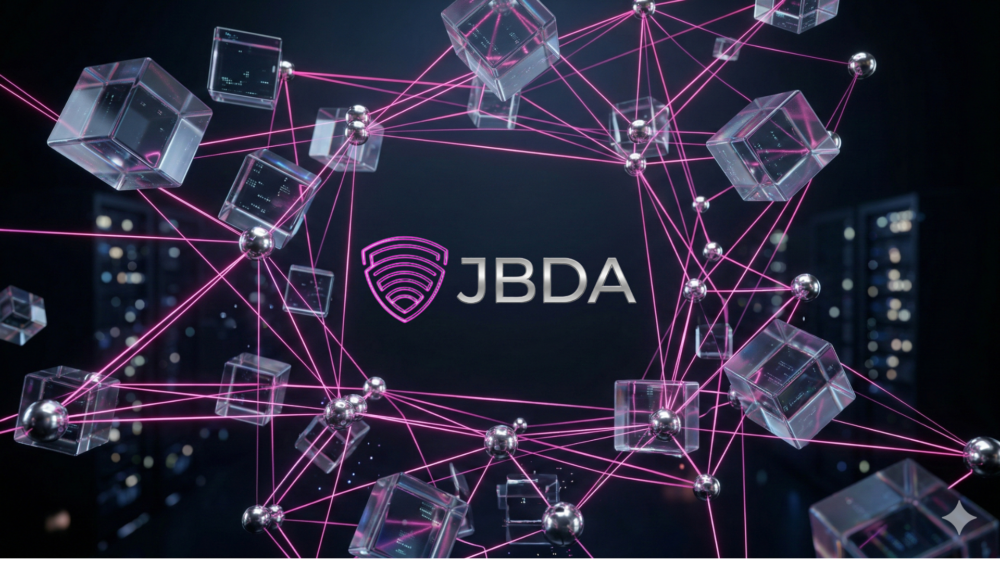

  
  
    

  # 🛡️ JBDA | Consultoría Estratégica en Redes
  
  **La columna vertebral de la infraestructura digital moderna.**

  
  
  
  
  

---

## 🌐 Visión General del Proyecto

Este repositorio contiene el código fuente oficial de la plataforma corporativa de **JBDA**. Diseñado bajo un enfoque B2B de nivel *Enterprise*, el sitio no solo funciona como un portafolio de servicios, sino como una demostración técnica en vivo de las capacidades de la firma.

El ecosistema está construido desde cero priorizando la velocidad, la seguridad (protección de propiedad intelectual) y una Experiencia de Usuario (UX) inmersiva, sin depender de frameworks pesados o plantillas prefabricadas.

---

## 🚀 Arquitectura Técnica y Features Exclusivos

* 🧠 **Simulador de Estrés Matemático:** Un motor en tiempo real basado en JavaScript que compara visualmente el consumo de CPU y latencia entre arquitecturas de red tradicionales vs. el modelo JBDA.
* ⚛️ **Físicas Inerciales (Smooth Scroll):** Implementación de *Lenis* para un desplazamiento fluido y cinemático, emulando la navegación nativa de sistemas operativos.
* 🎨 **UI de Cristal Líquido (Glassmorphism):** Diseño 100% en Modo Oscuro (Dark Mode) con transparencias calculadas en CSS y renders 3D abstractos.
* 🌐 **Routing Inteligente (Fricción Cero):** Script de auto-detección que redirige automáticamente al usuario a la versión en Inglés (`/en/`) o Español dependiendo de la configuración nativa de su navegador.
* 📱 **Progressive Web App (PWA):** Manifiesto integrado que permite a los directivos instalar la plataforma como una aplicación nativa en dispositivos iOS y Android.
* 🔒 **Seguridad y CI/CD:** Flujo de trabajo automatizado que minifica, comprime y ofusca el código HTML/CSS/JS antes de mandarlo a producción, garantizando tiempos de carga de milisegundos y protegiendo el código fuente.

---

## 📂 Estructura del Repositorio

    JBDA/
    ├── .github/workflows/      # 🤖 Scripts de automatización y despliegue (CI/CD)
    ├── assets/                 # 🖼️ Renders 3D, íconos SVG y logos premium
    ├── css/
    │   └── style.css           # 💅 Hoja de estilos principal (Variables, Dark Theme)
    ├── en/                     # 🇺🇸 Entorno de idioma Inglés
    │   ├── privacy/            # Políticas de privacidad en inglés
    │   └── index.html          # Interfaz principal (EN)
    ├── js/
    │   └── main.js             # ⚙️ Motor interactivo (Simulador, Canvas, Lenis)
    ├── privacidad/             # 🇲🇽 Políticas de privacidad (ES)
    ├── 404.html                # 🚫 Página de error personalizada (Rutas absolutas)
    ├── index.html              # 🇲🇽 Interfaz principal (ES)
    ├── manifest.json           # 📱 Configuración PWA
    └── README.md               # 📖 Documentación del proyecto

---

## 🛠️ Flujo de Despliegue (CI/CD)

Este proyecto utiliza **GitHub Actions** para su optimización y despliegue automático. 

1. El entorno de desarrollo es la rama `main`. Aquí el código está documentado, ordenado y legible por humanos.
2. Al realizar un `git push` hacia `main`, el archivo `deploy.yml` activa un servidor virtual que:
   - Instala Node.js.
   - Ejecuta comandos de minificación para purgar comentarios y espacios en blanco.
3. El código ultra-comprimido (versión pública) se despliega automáticamente en la rama `gh-pages`.

**⚠️ Importante para Editores:** Nunca modifiques el código directamente desde el navegador o en la rama `gh-pages`. Todos los cambios deben realizarse en `main`.

---

## 📞 Contacto Corporativo

**JBDA | Consultoría Estratégica en Infraestructura de Redes** Para auditorías de red, optimización de CAPEX o despliegue de arquitecturas multivendor, comuníquese a través del portal de asistencia:

* 🌐 **Web Oficial:** [www.TU-DOMINIO.com](https://www.TU-DOMINIO.com)  *(Nota: Actualiza este enlace)*
* ✉️ **Contacto:** [JBDA_Tech@icloud.com](mailto:JBDA_Tech@icloud.com)

 

  <small>Diseñado y desarrollado para el alto rendimiento B2B.</small>

